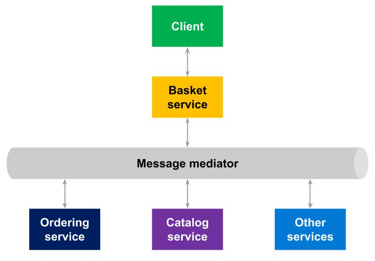
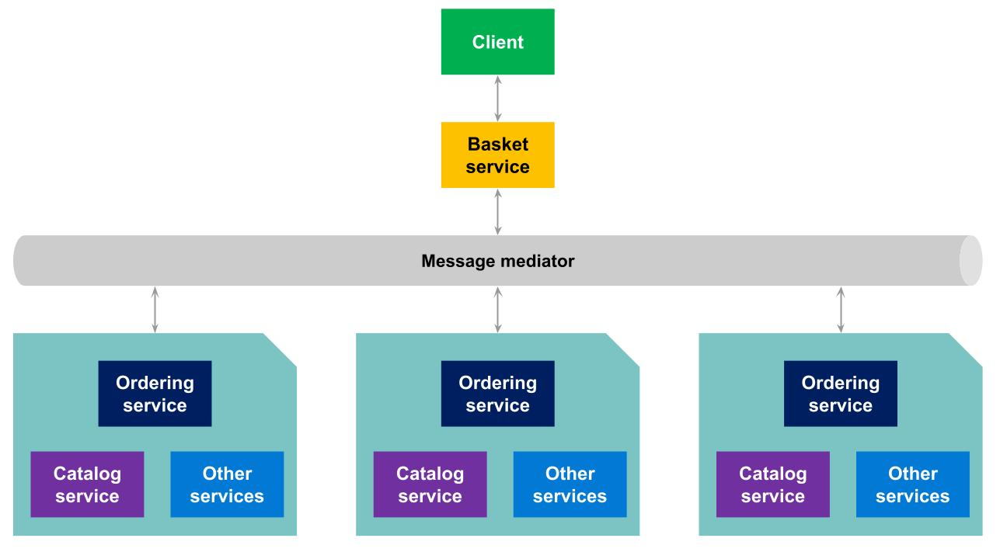

# Message mediator

__The library is a work in progress. It is not yet considered production-ready.__

[](https://github.com/MpStyle/microservicetoolkit/actions/workflows/build.yml)
[](https://github.com/MpStyle/microservicetoolkit/actions/workflows/release.yml)
[](https://opensource.org/licenses/MIT)


An interface to define how cloud microservices interact each other across multi instances, using **request-response** pattern.

## How to install

### Package Manager
```
Install-Package microservice.toolkit.messagemediator -Version 0.11.0
```

### .NET CLI
```
dotnet add package microservice.toolkit.messagemediator --version 0.11.0
```

### Package Reference
```
<PackageReference Include="microservice.toolkit.messagemediator" Version="0.11.0" />
```

## Introduction
In Microservice Toolkit, a microservice has a name (or pattern) and returns with the following structure:
```json
{
    "error": 12,
    "payload": {
        ...
    }
}
```
Where:
- __Error__ is the core of the error, it has value when an error occurs during service execution.
- __Payload__ is the output of the service, it has value when the execution goes well.

Only one of the fields can have a value: if "error" has a value, "payload" doesn't have it, and vice versa.

## Implementations

Microservice Toolkit provides message mediator (IMessageMediator) implementations which can exchange messages in a [single instance environment](#local) and in a multi instances environment using a message broker like [RabbitMQ](#rabbitmq), [Azure Service Bus](#servicebus) or [NATS](#nats).

Single instance environment:



Multi instances environment:



Every implementation of message mediator requires a "service factory" which link service name (pattern) to its instance.

### Local

<a name="local"></a>
To use in a single instance environment, in a desktop application, or to testing.

No external dependencies needed.

No external service will be query/use.

### RabbitMQ

<a name="rabbitmq"></a>
[RabbitMQ](https://www.rabbitmq.com/) is an open-source and lightweight message broker which supports multiple messaging protocols. It can be deployed in distributed and federated configurations to meet high-scale, high-availability requirements. In addition, it's the most widely deployed message broker, used worldwide at small startups and large enterprises.

To start building RabbitMQ-based microservices, first install the required packages:
```
Install-Package RabbitMQ.Client -Version 6.2.2
```
Or:
```
<PackageReference Include="RabbitMQ.Client" Version="6.2.2" />
```

### Azure Service Bus

<a name="servicebus"></a>
To start building [Azure Service Bus](https://learn.microsoft.com/en-us/azure/service-bus-messaging/service-bus-messaging-overview)-based microservices, first install the required packages:

```
Install-Package Microsoft.Azure.ServiceBus -Version 5.1.3
```
Or:
```
<PackageReference Include="Microsoft.Azure.ServiceBus" Version="5.1.3"/>
```

### NATS

<a name="nats"></a>
To start building [NATS](https://nats.io/)-based microservices, first install the required packages:

```
Install-Package NATS.Client -Version 1.0.2
```
Or:
```
<PackageReference Include="NATS.Clients" Version="1.0.2"/>
```

## How to use

### Service implementation
To implement a service, extend the abstract class "_Service<TRequest, TPayload>_", where:
- "_TRequest_" is the service input (or request)
- "_TPayload_" is the service output (or response payload)

Example code:

```C#
[Microservice("/user/exists")]
public class UserExists : Service<UserExistsRequest, UserExistsResponse>
{
    public async override Task<ServiceResponse<UserExistsResponse>> Run(UserExistsRequest request)
    {
        return this.SuccessfulResponse(new UserExistsResponse
        {
            Exists = "Alice" == request.Username
        });
    }
}
```

### Services registration

To register services, service factory and mediator into IoC (using __Microsoft Dependency Injection__), add to program startup ("__services__" is an instance of IServiceCollection):

```C#
using microservice.toolkit.messagemediator.extension;

[...]

// Registers all the microservices in the same assembly of "UserExists" class.
// Registers all the microservices as Singleton.
// Registers the service factory as Singleton.
var myAssembly = Assembly.GetAssembly(typeof(UserExists));
services.AddServiceContext(myAssembly);

[...]

// Registers message mediator 
services.AddSingleton<IMessageMediator, LocalMessageMediator>();
```

### Service call

To call a service using a mediator:

```C#
private readonly IMessageMediator mediator;

[...]

public MyClass(IMessageMediator mediator){
    this.mediator = mediator;
}

[...]

// to explicit only payload type:
var response = await mediator.Send<int>(typeof(SquarePow), 2));
// or, to explicit request and payload type:
var response = await mediator.Send<int, int>(typeof(SquarePow), 2));
```