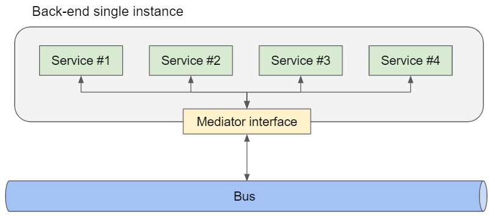
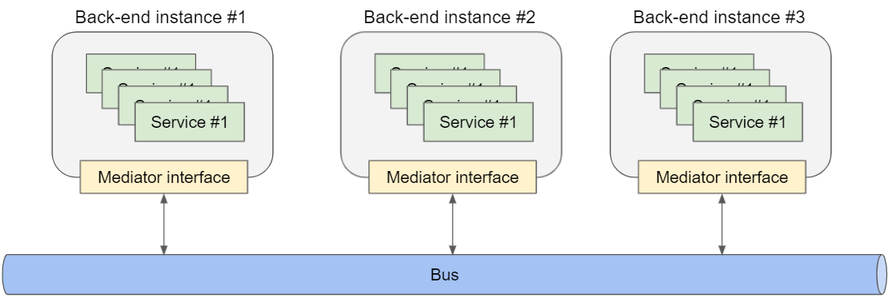

# Message mediator

__The library is a work in progress. It is not yet considered production-ready.__

An interface to define how microservices interact each other, request-response pattern.

## How to install

### Package Manager
```
Install-Package microservice.toolkit.messagemediator -Version 0.4.0
```

### .NET CLI
```
dotnet add package microservice.toolkit.messagemediator --version 0.4.0
```

### Package Reference
```
<PackageReference Include="microservice.toolkit.messagemediator" Version="0.4.0" />
```

## Introduction
In Microservice Toolkit, a microservice has a name (or pattern) and returns with the following structure:
```json
{
    "error": 12,
    "payload": {
        ...
    }
}
```
Where:
- __Error__ is the core of the error, it has value when an error occurs during service execution.
- __Payload__ is the output of the service, it has value when the execution goes well.

Only one of the fields can have a value: if "error" has a value, "payload" doesn't have it, and vice versa.

### Service implementation
To implement a service, extend the abstract class "_Service<TRequest, TPayload>_", where:
- "_TRequest_" is the service input (or request)
- "_TPayload_" is the service output (or payload of the response)

Example code:

```C#
public class UserExists : Service<UserExistsRequest, UserExistsResponse>
{
    public async override Task<ServiceResponse<UserExistsResponse>> Run(UserExistsRequest request)
    {
        return this.SuccessfulResponse(new UserExistsResponse
        {
            Exists = "Alice" == request.Username
        });
    }
}
```

### Service call

To call a service we can use a mediator:

```C#
// Instantiates the mediator
var mediator = [...]

var response = await mediator.Send(nameof(SquarePow), 2));
// or, to explicit payload type::
var response = await mediator.Send<int>(nameof(SquarePow), 2));
// or, to explicit request and payload type:
var response = await mediator.Send<int, int>(nameof(SquarePow), 2));
```

## Implementations

Microservice Toolkit provides some implementations of the message mediator interface:
- [Local](#local)
- [RabbitMQ](#rabbitmq)
- [Azure Service Bus](#servicebus)

The implementations of __message mediator__ can work in a single instance environment



or in a multi instances environment:



Every implementation requires a "service provider" (a delegate) to link the name (pattern) to the instance of a service.

Using __Microsoft Dependency Injection__ in a startup program:

```C#
// Registers the message mediator (services is an instance of IServiceCollection)
services.AddSingleton<IMessageMediator, LocalMessageMediator>();

// Uses assembly scan to retrieve all the "IService" implementations
var microservices = Assembly.GetAssembly(typeof(MyService))
    .GetExportedTypes()
    .Where(y => y.IsClass && !y.IsAbstract && !y.IsGenericType && !y.IsNested)
    .Where(c => c.GetInterfaces().Any(i => i == typeof(IService)));

// Registers all the microservices to the IoC
foreach (var microservice in microservices)
{
    services.AddSingleton(microservice);
}

// Registers the "service provider" to resolve pattern (string) to a service instance
services.AddSingleton<ServiceFactory>(serviceProvider => pattern =>
{
    return serviceProvider.GetService(microservices.First(ms => ms.Name.Equals(pattern))) as IService;
});
```

### Local

<a name="local"></a>
To use in a single instance environment or for testing.

No external dependencies needed.

No external service will be query/use.

### RabbitMQ

<a name="rabbitmq"></a>
RabbitMQ is an open-source and lightweight message broker which supports multiple messaging protocols. It can be deployed in distributed and federated configurations to meet high-scale, high-availability requirements. In addition, it's the most widely deployed message broker, used worldwide at small startups and large enterprises.

To start building RabbitMQ-based microservices, first install the required packages:
```
Install-Package RabbitMQ.Client -Version 6.2.2
```
Or:
```
<PackageReference Include="RabbitMQ.Client" Version="6.2.2" />
```

### Azure Service Bus

<a name="servicebus"></a>
To start building Azure Service Bus -based microservices, first install the required packages:

```
Install-Package Microsoft.Azure.ServiceBus -Version 5.1.3
```
Or:
```
<PackageReference Include="Microsoft.Azure.ServiceBus" Version="5.1.3"/>
```