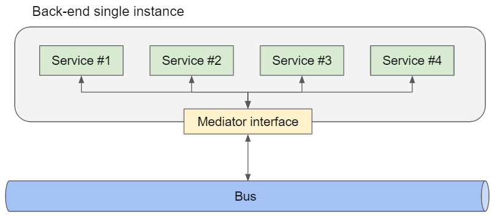
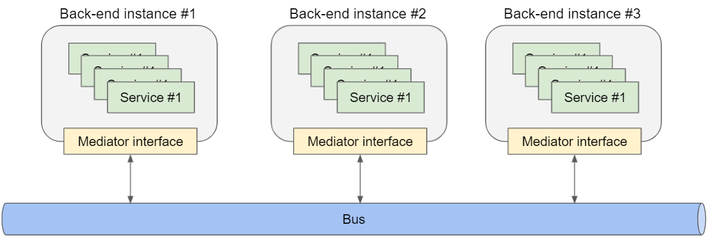

# Message mediator

An interface to define how microservices interact each other.

Microservice Toolkit provides some implementation of the message mediator interface:
- [Local](#local)
- [RabbitMQ](#rabbitmq)
- [Azure Service Bus](#servicebus)

Every implementation can work in a single instance environment



and in a multi instances environment:



### Local

<a name="local"></a>
To use in a single instance environment or for testing.

### RabbitMQ

<a name="rabbitmq"></a>
RabbitMQ is an open-source and lightweight message broker which supports multiple messaging protocols. It can be deployed in distributed and federated configurations to meet high-scale, high-availability requirements. In addition, it's the most widely deployed message broker, used worldwide at small startups and large enterprises.

#### Installation

To start building RabbitMQ-based microservices, first install the required packages:
```
Install-Package RabbitMQ.Client -Version 6.2.2
```
Or:
```
<PackageReference Include="RabbitMQ.Client" Version="6.2.2" />
```

### Azure Service Bus

<a name="servicebus"></a>
```
Install-Package Microsoft.Azure.ServiceBus -Version 5.1.3
```
Or:
```
<PackageReference Include="Microsoft.Azure.ServiceBus" Version="5.1.3"/>
```

## Overview

To make know the mediator how to retrieve the instances of micro-services implement the delegate "_ServiceFactory_":

Example:
```C#
// Service factory
var serviceFactory = new ServiceFactory((string pattern) => serviceProvider.GetService(microservices[pattern]) as IService)

[...]

// Message mediator, you can use the dependency injection to instantiate it
var messageMediator = new LocalMessageMediator(logger, serviceFactory)

[...]

// Send a message
var response = await messageMediator.Send<UserExistsRequest, UserExistsResponse>(nameof(UserExists), new UserExistsRequest
{
    Username = "Alice"
});
```